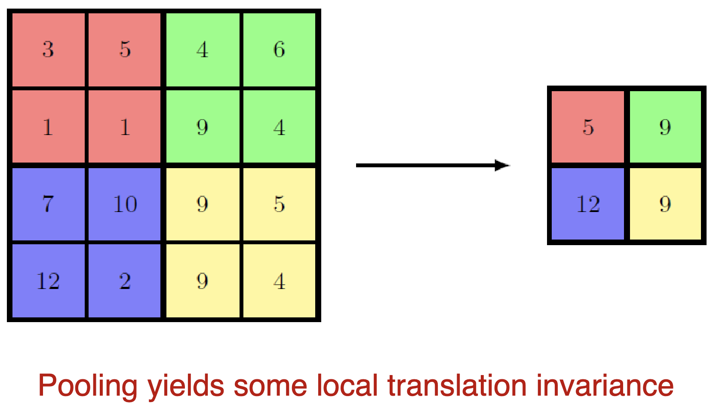
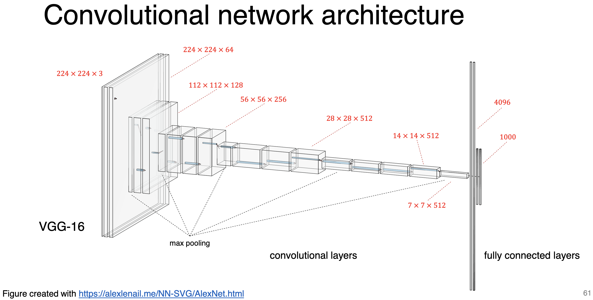

# Lecture 1: Convolutional Layer

## Convolutional Layer

|  |  |  |  |
| :----------------------------------------------------------: | :----------------------------------------------------------: | :----------------------------------------------------------: | :----------------------------------------------------------: |
|                   padding=0 stride=1                    |                   padding=1 stride=1                    |                   padding=0 stride=2                    |                   padding=1 stride=2                    |

考虑输入 $I=Input, K=Kernel, S=Stride, P=Padding$:
$$
O_{I} = \left\lfloor \frac{I+2P-K}{S} \right\rfloor +1
$$
如果考虑多通道的图片，$C=Channel$，则图片为：
$$
(C\times W \times H)
$$
**单通道卷积：**如果是一个单通道的卷积，即卷积核为 $\kappa = (K_W\times K_H)$, 则最后输出为
$$
(C \times O_{W}\times O_{H})
$$
如果考虑有 $M$ 个卷积核，即 $\boldsymbol{\kappa}=\lang\kappa_1, \kappa_2, \cdots, \kappa_M\rang$，则有
$$
\mathbf{O}_M : (M\times C\times O_{W} \times  O_{H})
$$

**跨通道卷积：**如果卷积核 $\kappa$ 有通道，则其必须和图片的通道数一致，即 $C_\kappa = C$，因此卷积核为 $\kappa = (C\times K_W\times K_H)$

这时候的计算即为对每个通道使用对应的卷积核进行卷积，最后求和得到一个最终卷积的输出。计算过程类似于：
$$
O = {\mathop{\boxplus} \limits_{c=1}^C} I_c \odot \kappa_c
$$
用图像来说，假设有 R, G, B 3个通道，则卷积核也有 3 个通道 r, g, b。对每个图像分别卷积，可得：
$$
\begin{cases}
O_R = R \odot r \\
O_G = G \odot g \\
O_B = B \odot b
\end{cases}
\longrightarrow
O=\sum_\text{elementwise} [O_R, O_G, O_B]
$$
最终的 $O$ 将会有如下形状：
$$
O : (O_{W} \times O_{H})
$$
如果考虑有 $M$ 个卷积核，即 $\boldsymbol{\kappa}=\lang\kappa_1, \kappa_2, \cdots, \kappa_M\rang$，则有
$$
\mathbf{O}_M : (M\times O_{W} \times  O_{H})
$$

> $\mathop{\boxplus}$  或 $\sum$ elementwise或pointwise的下标表示为逐元素操作。不实用 $\bigoplus$ 是为了避免与 XOR 进行混淆

## Max Pooling

## VGG-16

>  参阅 https://alexlenail.me/NN-SVG/AlexNet.html

