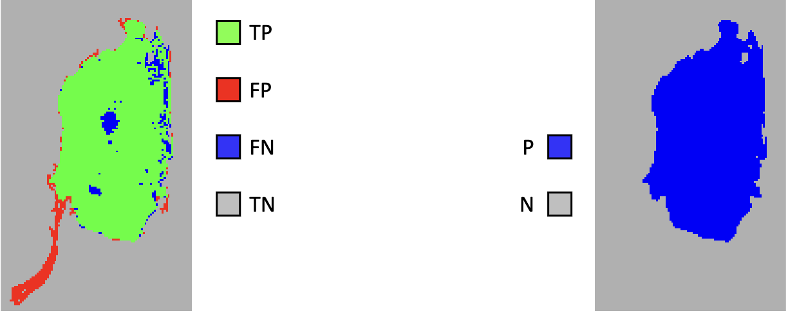
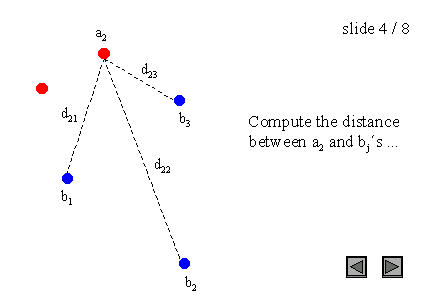
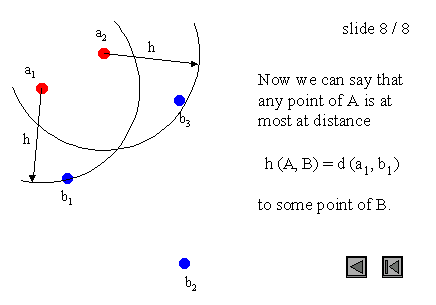

# Lecture 2: Image Segmentation

[TOC]

## Problems

Seg 有很多问题：噪声，partial volume effect，强度不均匀性（intensity inhomogeneities）、各向异性分辨率（anisotropic resolution），成像伪影（imaging artifacts），对比度受限，形态变异性（morphological variability）

### Noise

### Partial Volume Effect

现实空间是连续的，但是相机采样是离散的。

### Intensity inhomogeneiti

同一种组织在图像不同位置可能会呈现出不同的亮度/强度值。这种不均匀性主要由以下因素导致：

1. 在MRI中：

   - 射频线圈（RF coil）的不均匀性

   - 静态磁场（B0）的不均匀性

   - 射频场（B1）的不均匀性

   - 患者的解剖结构导致的电磁场变化

2. 在超声成像中：

   - 声波在组织中的衰减

   - 声波传播路径上的阻抗变化

   - 组织深度不同造成的回波强度差异

这种不均匀性会对图像分割造成困难，因为：

- 相同的组织可能会有不同的灰度值
- 使基于阈值的分割方法效果变差
- 增加了自动分割算法的复杂度

从图中可以看到，即使是同一类型的组织，在图像的不同区域也会呈现出不同的亮度，这就是强度不均匀性的典型表现。

### Anisotropic Resolution

几乎所有 3D 影像成像都有这个问题（例如 CT和 MRI）

例如横向扫描（Short Axis），那么它的图像是上测。

但是对于纵向，那么每次扫描都是间隔的。

### Imaging Artifacts

### Limited Contrast

不同的组织可能具有相似的物理特性，因此呈现出相似的强度值

纯粹基于强度的算法容易失效或"泄漏"（Leak）到邻近组织中

### Morphological Variability

形态的多变性使我们很难纳入有意义的先验信息或有用的形状模型

## Evaluation

### Ground Truth vs Gold Standard

Ground Truth 是可以用来与方法进行比较的 Reference/Standard，例如最优变换或真实的分割边界

> 真值通常仅适用于：
>
> - 合成或模拟模型（例如，计算机模型）
> - 物理模型（例如，凝胶模型）

Gold Standard 是Expert（通常被称为Gold Standard）。由人类观察者（例如经验丰富的临床医生）进行手动分割。

需要培训且耗时费力

**Intra-observer variability 观察者内部变异性**：同一观察者在不同时间的分歧

**Inter-observer 观察者之间变异性**：观察者之间的分歧

解决方案 Remedy

- 人类观察者可以重复进行分割
- 多位专家可以进行分割
- 可以量化一致性或分歧程度

### Assess Performance

Precision 是对随机误差的描述，用于衡量统计可变性

- 指测量的可重复性或再现性

Accuracy 有两种定义：

- 更常见的定义是对系统误差的描述，用于衡量统计偏差；因为这些误差导致结果与"真实"值之间存在差异，ISO 将其称为真实度(trueness)
- 另外，ISO 将 Accuracy 定义为上述两种观测误差(随机和系统误差)的组合，因此高准确度需要同时具备高精确度和高真实度

> **观测误差**（或**测量误差**）是某个量的测量值与其未知真值之间的差值。
> 测量误差可分为两部分：*随机误差*和*系统误差*。
>
> **随机误差**是测量中的误差，当对恒定属性或数量进行重复测量时，会导致可测值不一致。随机误差会造成测量不确定性。
>
> **系统误差**不是由偶然决定的误差，而是由系统固有的可重复过程引入的误差。系统误差也可能指均值不为零的误差，当对观测值取平均值时，其影响不会减小。

Robustness：在不同噪声水平或其他成像伪影条件下性能降低的程度

### Performance Measure

根据结果与 reference gold standard 的一致性来衡量自动方法的性能

> Type I: 判无罪有罪
> Type II: 有罪变无罪

$$
\begin{align*}
Acc &= \frac{TP+TN}{P+N}
&\text{(Accuracy)}
\\
PPV &= \frac{TP}{TP+FP}
=\frac{TP}{TP+\text{Type I Error}}
&\text{(Precision/Positive Predictive Value)}
\\
TPR &= \frac{TP}{TP + FN}
=\frac{TP}{TP+\text{Type II Error}}
&\text{(Recall/Sensitivity/Hit Rate/True Positive Rate)}
\\
TNR &= \frac{TN}{TN+FP}
&\text{(Specificity/True Negative Rate)}
\end{align*}
$$

F1...

### Overlap Measures

如考虑如下定义：
$$
\begin{align*}
|A| &= TP + FN\\
|B |&= TP + FP\\
|A\cup B| &= TP
\end{align*}
$$

$$
\begin{align*}
\text{JI} &=
\frac{|A\cap B|}{|A\cup B|} &= \frac{TP}{TP+FN+FP}
\\
\text{DSC} &= \frac{2|A\cap B|}{|A| + |B|}
&=
\frac{2TP}{2TP + FN +FP}
\\

\text{DSC}  &\Lrarr F_1
\end{align*}
$$

$$
\begin{align*}
\text{Volumne Similarity (VS)}
&= 1-\frac{||A|- |B||}{|A|+|B|}
&=1-\frac{|FN-FP|}{2TP+FP+FN}
\\
\text{Hausdorff Distance (HD)} &=
\max(h(A, B), b(B,A))\\
h(A, B) &= \max_{a\in A} \min_{b\in  B} \Vert a-b\Vert
\\
\\
\text{(Symmetric) Average Surface Distance (ASD)}
&= \frac{d(A, B)+d(B,A)}{2}
\\
d(A, B) &=
\frac{1}{N}\sum_{a\in A}\min \Vert a - b \Vert

\end{align*}
$$

> **Hausdorff Distance**
>
> https://cgm.cs.mcgill.ca/~godfried/teaching/cg-projects/98/normand/main.html
>
> |  |  |  |
> | ----------------------------- | :---------------------------: | ----------------------------- |
> |  |  |  |
>|  |  |                               |
> 
>|  |  |
> | :---------------------------: | :---------------------------: |
>|           Extreme 1           |           Extreme 2           |

> Surface Distance
>
> 直接计算 SD 很慢，因此使用Euclidean Distance Map计算
>
> 
>
> |  | $\to$ |  |
> | :----------------------------------------------------------: | :---: | :----------------------------------------------------------: |
> |                            原形状                            | $\to$ |                    Euclidean Distance Map                    |
>
> |  |  |  |  |
> | :----------------------------------------------------------: | :----------------------------------------------------------: | :----------------------------------------------------------: | :----------------------------------------------------------: |
> |                       0px contour line                       |                      30px contour line                       |                      50px contour line                       |                      100px contour line                      |
>
> 如果需要计算对应的欧式距离：
>
> 
>
> 
>
> 将一个等高线边界上的像素点距离与另一个等高线的距离图相加

### Pitfalls

#### Structure Size

|  |  |
| :----------------------------------------------------------: | :----------------------------------------------------------: |
|                         大 structure                         |                         小 structure                         |

都是差别 1 和 2 px，小 structure 受影响更大。

Micro Average 的指标会受到 small structure 大影响。

#### Structure Shape

#### Annotation Noise

#### Empty Labelmap

#### Resolution

## Segmentation Method

▪ Intensity-based segmentation (e.g., thresholding)
▪ Region-based (e.g., region growing)
▪ Graph-based segmentation (e.g., graph cuts)
▪ Active contours (e.g., level sets)
▪ Atlas-based segmentation (e.g., multi-atlas label propagation)
▪ Learning-based segmentation (e.g., convolutional neural networks)

### Thresholding

> **优点：**简单，快速
>
> **缺点：**
>
> - 区域必须是均质且明显分离的
> - 难以在不同图像间找到一致的阈值
> - 容易出现泄漏 leakages 、孤立 isolate 像素和"粗糙" rough 边界

### Region Growing

从（用户选择的）种子点开始，根据强度阈值扩展区域

| Seed 1 |  |  |
| :----: | :----------------------------------------------------------: | :----------------------------------------------------------: |
| Seed 2 |  |  |
| Seed 3 |  |  |

> 优点：相对较快，可以从种子点生成连通区域
>
> **缺点：**
>
> - 区域必须是均质的（同质的）homogeneous
> - 容易出现泄漏leakages和"粗糙"rough边界
> - 需要（用户）输入种子点

### Atlas-based Segmentation

|  |  |
| ------------------------------------------------------------ | :----------------------------------------------------------: |
|                                                              |                         Label Fusion                         |

逻辑大概是，先对数据进行标注，形成 Atlas（也被称为 Template）。

将待分析的新图像与标准图谱进行配准(registration)对齐。这样 $N$ 个 Atlas 可以形成 $N$ 个 Segmentation。然后通过 Label Fusion 整合所有 Segmentation。

利用图谱中已有的解剖结构标记信息来指导新图像的分割。

例如同一个像素，5个Atlas可以形成5种 segmentation。Label Fusion 可以选择 Majority Voting，选择大多数。（也可以看作是概率）。

