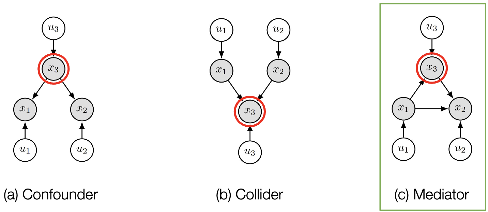
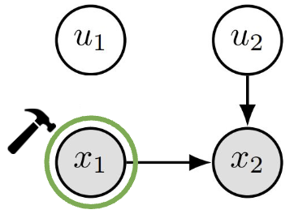

# Lecture 5: Causality in Medical Imaging

## Rules

### Reichenbach’s Common Cause Principle

如两个事件概率成正相关，即 $p(A \cap B) > p(A)p(B)$，假设两个事件都不是另一个事件的原因，则其存在一个 unknown factor $U$ 作为桥梁，使得
$$
A\larr U \rarr B
$$

### Simpson’s Paradox

一种趋势出现在几组数据中，但当这些组数据组合在一起时，趋势就会消失或逆转。

> 令 $S$: Stone Size, $T$ 接收到的 Treatment, $R$ 为恢复率
>
> 
>
> 尽管无论结石大小， $T_A$ 全部都比 $T_B$ 好，但是合并 会发现 $T_A$ 没有 $T_B$ 好。观察 causal graph
>
> 
>
> Stone Size 会影响 Treatment。$S$ 是一个 confounder （干扰项）。令 $T$ indeendent of $S$，也就是 
>
> 

## Predictive Modelling

给定图像 $X$，和其标签 $Y$。假设足够的数据集提供，测试和训练时同分布的。
$$
\begin{align*}
\text{(Causal) }&X\to Y
\\
\text{(Anti-Causal) }&Y\to X
\end{align*}
$$

> 假设建模为 $P(Y\mid X)$
>
> > $X$ 为皮肤病图片
> > $Y$ 是病理活检诊断。
> >
> > 因果可以说是因为疾病，因此是图片，构建出causal
> > $$
> > \text{Anti-cause: }X\larr Y
> > $$
>
> > $X$ 是结构大脑 MRI。
> > $Y$ 是手动画出的等高线。
> > $$
> > \text{cause: }X\rarr Y
> > $$
> > 
>
> > $X$ 是胸部 X 光照片。
> > $Y$ 是从报告获取的诊断。
> >
> > 不清楚诊断结果是是通过图像还是其他化验结果得出的。无法构建因果。

## Ladder of Causation

假设事件 $X, Y$。

Association （关联）：$P(Y\mid X)$。仅看到现象之间的相关性。
Intervention（介入）：$P(Y\mid X)$。通过干预理解直接因果关系。
Counterfactuals （反事实）：$P(Yx\mid X=x', Y=y)$。"如果...会怎样"。

## SCM: Structural Causal Models

SCM 是一个三元组：
$$
\mathcal{M} := \lang X, U. F\rang
$$
$X=\{ x \}^N$: 变量，观测到的。
$U=\{ u \}^N$: 变量，未观测到的。
$F=\{f\}^N$：函数，causal mechanisms

每一个变量是其 parents 的函数，即：
$$
x_k := f_k(\text{parent}_k, u_k),\qquad\forall k=1,\dots, N
$$
这里缩写 $\text{parents}$ 缩写为 $pa$

> Simple SCM
>
> $x_1, x_2$ 是内源的（endogenous）
> $u_1, u_2$ 是外源的（exogenous）
>
> 
>
> 因此可以构建为
> $$
> \begin{align*}
> x_1 &:= f_1(u_1)  &u_1 \sim \mathcal{N}(0,1)
> \\
> x_2 &:= f_2(x_1,u_2)  &u_2 \sim \mathcal{N}(0,1)
> 
> \end{align*}
> $$

Acyclic SCMs 可以被表示为 DAGs （有向无环图，Directed Acyclic Graphs）。边缘上 causes 到 effects 到函数。

我们可以构建 3 个不同的因果模型

Confounder: 混杂因素
Collider: 对撞机
Mediator: 调解者

## Distribution

### Observational Distribution

SCMs 如果有 independent exogenous noises 是 Markovian
$$
P(u_1,\dots, u_N)=\prod^N_{k=1}p(u_k)
$$
Markovian SCM 则 endogenous variable 的观测分布：
$$
p_\mathcal{M}(x_1, \dots, x_N)
= \prod^N_{k=1}p_\mathcal{N}(x_k \mid pa_k)
$$
Causal Markov Condition: 鉴于其 direct causes，每个变量都与其非后代变量无关

> 一阶马尔可夫过程（马尔科夫性质）：
> $$
> p(x_t|x_{t-1},x_{t-2},...,x_1) = p(x_t|x_{t-1})
> $$
> 二阶马尔可夫过程：
> $$
> p(x_t|x_{t-1},x_{t-2},...,x_1) = p(x_t|x_{t-1}, x_{t-2})
> $$

### Interventional Distribution

SCMs 使用 interventions 预测因果效应

Interventions: 替换结构性 Assignments，例如 $do(x_k := c)$

这导致了一个子模型 $\mathcal{M}_c$。其分布被定义为：
$$
p_{\mathcal{M}_c}(X\mid do(c))
$$

这间接敲除了 $u1$

### Counterfactuals (Hypothetical Scenarios)

给定观测变量 $(x_1, x_2)$。如果 $x_1 =c$，那么 $x_2$ 会是多少？

1. Abduction：推断 Unobservation $P(U\mid X)$
2. Action： $do(\tilde{x}_k := c)$ 获得子模型 $\mathcal{M}_c$
3. Prediction: 使用 $\langle \mathcal{M}_c, P(U\mid X)\rang$ 去计算 counterfactuals

## Normalising Flow

NF通过对简单的基础分布进行连续（successive）可逆的变形得到。

也就是说
$$
\begin{align*}
x &= f_\theta(pa_x, u_x)\\
u_x &= f_\theta^{-1}(pa_x, x)

\end{align*}
$$

这里的 $pa_x = y$

 

